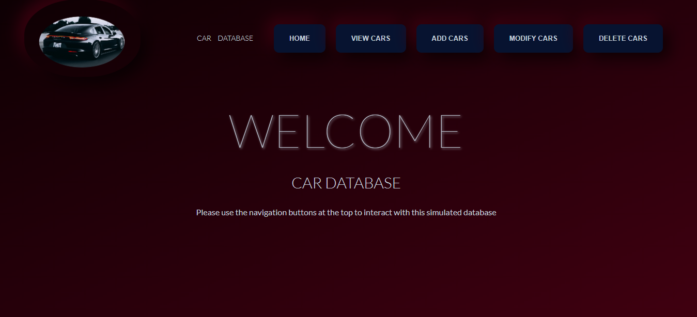
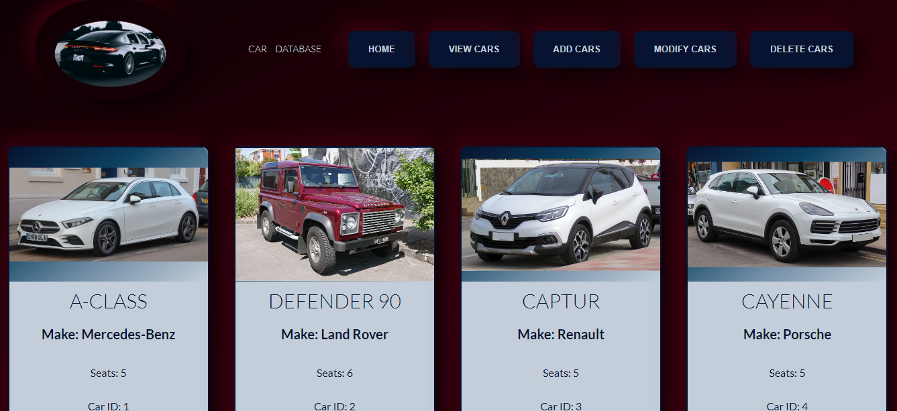
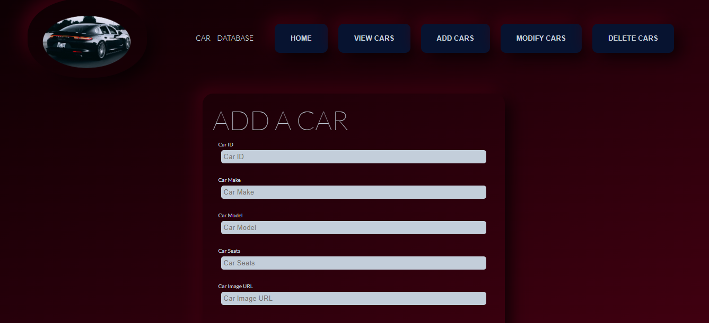
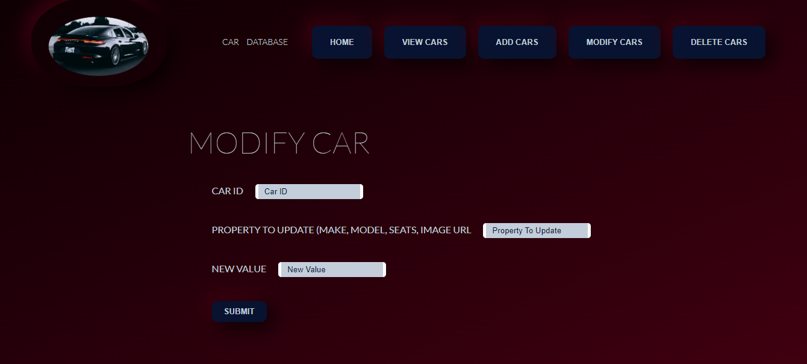
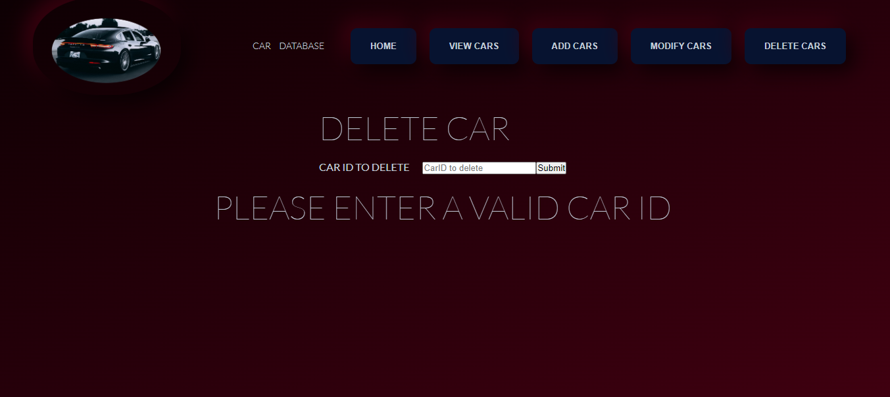

# The car-fs-api Full Stack React/Express Application v1.0.0

This project was bootstrapped with [Create React App](https://github.com/facebook/create-react-app).

## Index
1. Introduction
2. Installation
3. Usage
4. Credits and Versioning

### 1. Introduction

This is a full stack React/Express application built to experiment with combining of the two technologies to create a fully functional web application. 

### 2. Installation

The application needs requires dependency installation on both the backend and frontend.  

Change directory to the root folder of the project which is called car_api and run  

`yarn install`  

Then change directories to car_api/frontend and run the compand again:  

`yarn install`  

At this point the dependencies should all be in place and the installation is completed.  

### 3. Usage

To run the application a similar process is needed to that used in the installation. The server should be started by changing into the root directory car_api and running the command:  

`yarn start`

The React frontend should then be started by changing into the directory car_api/frontend and running the command:  

`yarn start`

Once started the following landing page will appear and navigation takes place via the navigation buttons at the top of the page.  

The pages that can be navigated to appears below and the site is very user friendly with instructions on what information needs to be entered in the different fields of each page or functionality of the site.  

  

  

  

### 4. Credits and Versioning

This application was design and developed by Johann Jansen van Vuuren. The current version, v1.0.0, was released on 31 March 2023.  

